# Desafio DevOps Pleno — Malha de Serviços

Este repositório contém o provisionamento de infraestrutura e a configuração de uma malha de serviços (Service Mesh) utilizando Kubernetes (k3s) e Istio. Além disso, foi utilizado Prometheus para fins de monitoramento e KEDA para autoscaling horizontal.

## 1. Justificativa da Ferramenta de Provisionamento

Foi escolhido o **Vagrant** utilizando o provider **libvirt (KVM)**. Essa combinação facilita um ambiente local isolado, idêntico para qualquer avaliador, e com alta performance no Linux. Isto porque o Vagrant utiliza um arquivo - o `Vagrantfile` - que segue o princípio da Infraestrutura como Código, facilitando a reprodutibilidade, enquanto que o `libvirt` oferece performance de virtualização nativa no Linux, devido à sua interação de baixo nível com o KVM (Kernel-based Virtual Machine).

## 2. Arquitetura e Fluxo de Tráfego

A arquitetura foi projetada sobre um único nó (K3s/Vagrant) operando sob os princípios de Zero Trust Network. O ambiente utiliza o Istio para desacoplar a lógica de rede e segurança da aplicação, transferindo essas responsabilidades para os sidecars (Envoy Proxies) injetados em cada pod.

### 2.1 Topologia
* **`istio-system`:** Hospeda o Control Plane do Istio (`istiod`) e o Ingress Gateway (`istio-ingressgateway`), que atua como a porta de entrada do cluster.

* **service-1:** Exposto externamente para receber requisições de clientes. Executa sob a Service Account `service-1-sa`.
* **service-2:** Estritamente isolado do tráfego externo, configurado para ser acessível exclusivamente pelo `service-1`. Executa sob a Service Account `service-2-sa`.

* **service-3:** Também exposto diretamente a clientes externos, mas blindado lateralmente contra os outros serviços do cluster. Executa sob a Service Account `service-3-sa`.

### 2.2 Tráfego de rede
O roteamento ocorre em duas esferas principais:

* **Tráfego externo para dentro do Cluster**:

        O cliente faz uma requisição HTTP para o istio-ingressgateway.

        O recurso Gateway (service-1-gateway ou service-3-gateway) abre a porta 80.

        O VirtualService (service-1-vs ou service-3-vs) intercepta o tráfego destinado ao host service-1.local e o direciona para o pod do service-1 e faz a mesma coisa com o tráfego destinado ao service-3.local.

* **Comunição interna ao Cluster**:

        Quando o service-1 precisa acessar o service-2, um VirtualService secundário (route-to-service-2) gerencia a rota interna.

        Uma DestinationRule (mtls-to-service-2) força o Envoy do service-1 a iniciar um handshake TLS mútuo (ISTIO_MUTUAL) antes de enviar o pacote para o service-2.

### 2.3 Segurança e políticas aplicadas
* **Onde é validado o JWT:** 
    * A validação ocorre diretamente no Envoy sidecar do `service-1` e `service-3` (via `RequestAuthentication`). 
    * O recurso `RequestAuthentication` inspeciona o cabeçalho HTTP em busca do token assinado, identificando o remetente. Uma `AuthorizationPolicy` vinculada garante que nenhuma requisição externa passe sem um token JWT válido, bloqueando conexões anônimas na origem.

* **Onde o mTLS atua:** Configurado globalmente como `STRICT` no namespace `istio-system` (via `PeerAuthentication`), garantindo que toda a comunicação interna seja criptografada.
* **Uso da ServiceAccount nas AuthorizationPolicies:** 
    * **Isolamento do service-2 (*whitelisting*)**: A AuthorizationPolicy do service-2 possui uma regra `ALLOW` explícita. Ela avalia a identidade `mTLS` do cliente e só autoriza a conexão se o `source.principal` for a identidade do `service-1-sa`. Qualquer outra origem ou acesso anônimo é negado por padrão.

    * **Isolamento do service-3 (*blacklisting*):** Como o `service-3` atende a clientes externos validados via `JWT`, sua `AuthorizationPolicy` intra-cluster aplica uma regra de `DENY`. Ela bloqueia explicitamente qualquer tentativa de acesso interno caso o `source.principal` corresponda às identidades do `service-1-sa` ou `service-2-sa`, garantindo que não haja trânsito lateral indevido.


## 3. JWT e JWKS

* **Geração:** Utilizou-se um token estático pré-gerado (assinado via RSA) disponibilizado pelo repositório oficial de ferramentas de segurança do Istio.
* **Configuração:** O cluster foi configurado para confiar no emissor `testing@secure.istio.io`. A validação da assinatura ocorre localmente pelo Istio (sem necessidade de um Identity Provider dedicado no cluster), que consulta o endpoint público de chaves (**JWKS** - `jwksUri`) para confirmar a autenticidade do token.

## 4. Passo a Passo Reproduzível

O ambiente foi projetado para exigir o mínimo de intervenção humana possível. Assume-se uma máquina host baseada em Linux (Ubuntu/Debian) para a execução nativa do script.

### Passo 1: Clonar o repositório
Baixe o código e navegue até a pasta de provisionamento do Vagrant:

```bash
git clone https://github.com/rayssa-eng/desafio-devops-pleno.git
cd desafio-devops-pleno/environment/vagrant
```

### Passo 2: Executar o Setup Automatizado
O script principal cuidará da instalação das dependências de virtualização (KVM/libvirt) no host e orquestrará a subida do cluster. *Nota: o script pedirá a senha do usuário (`sudo`) uma única vez para instalar os pacotes do libvirt.*

```bash
chmod +x setup.sh
./setup.sh
```

### Passo 3: Acompanhar a Automação (Hands-off)
A partir deste ponto, o processo é 100% automatizado. Você acompanhará no terminal a evolução das seguintes etapas:

1. Instalação e configuração do `qemu-kvm` e `vagrant-libvirt` no host.
2. Download da imagem do SO e subida da VM via Vagrant.
3. Inicialização do *Control Plane* do K3s (gerando um token seguro automaticamente).
4. Execução do `bootstrap.sh` interno, que injeta a malha do Istio, configura o Kustomize, instala o stack de monitoramento (Prometheus + KEDA) e sobe os três serviços com suas respectivas políticas de segurança.

> ⏳ **Tempo estimado:** Entre 5 e 8 minutos (dependendo da velocidade de download das imagens).
> 
> Ao final da execução, os pods estarão subindo, com a maioria em estado `Running` e você verá a mensagem: **"🚀 Ambiente provisionado"**.

## 5. Comandos de Validação

Para comprovar a eficácia das políticas de segurança aplicadas (Zero Trust, mTLS e RBAC), prepare o ambiente exportando as variáveis abaixo. 

*Nota: Certifique-se de estar com as portas mapeadas ou executando de dentro do host que enxerga o cluster.*

```bash
cd desafio-devops-pleno/environment/vagrant
vagrant ssh server

# Exporta o IP do Node (Ingress Gateway) e o Token JWT válido
export CLUSTER_IP=$(kubectl get nodes -o jsonpath='{.items[0].status.addresses[0].address}')
export TOKEN=$(curl -s https://raw.githubusercontent.com/istio/istio/master/security/tools/jwt/samples/demo.jwt)
```

### 5.1. Cenários de Autenticação JWT

Como o `service-1` e o `service-3` são expostos externamente, ambos exigem validação de token na borda. Simulamos as requisições passando o cabeçalho `Host` para que o *VirtualService* faça o roteamento correto.

**Para o `service-1`:**
1. **Com token válido (Esperado: 200 OK):**
   ```bash
   curl -i -H "Host: service-1.local" -H "Authorization: Bearer $TOKEN" http://$CLUSTER_IP/
   ```
   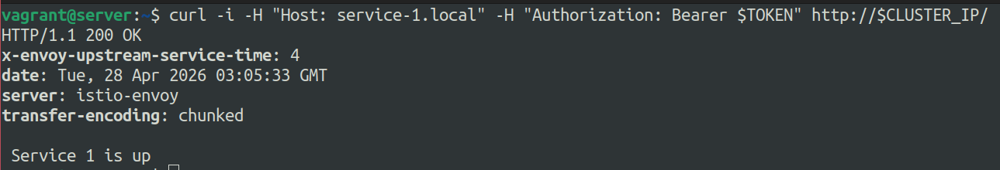

2. **Sem token (Esperado: 403 Forbidden):**
   ```bash
   curl -i -H "Host: service-1.local" http://$CLUSTER_IP/
   ```

   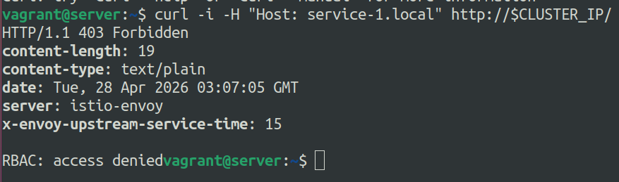

3. **Com token inválido (Esperado: 401 Unauthorized):**
   ```bash
   curl -i -H "Host: service-1.local" -H "Authorization: Bearer token-adulterado" http://$CLUSTER_IP/
   ```

   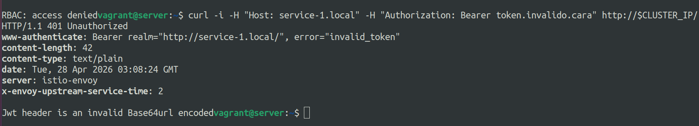

> **Observação:** > Por *design* do Istio, quando uma requisição é enviada **sem** token, o `RequestAuthentication` a ignora e a avaliação cai na `AuthorizationPolicy`. Como a requisição se torna anônima e não possui os `requestPrincipals` exigidos, o Istio a bloqueia nativamente via RBAC com um **403 Forbidden** (e não 401). O **401 Unauthorized** é retornado exclusivamente quando o token está presente no cabeçalho, mas falha na validação criptográfica.

**Para o `service-3`:**
1. **Com token válido (Esperado: 200 OK):**
```bash
curl -i -H "Host: service-3.local" -H "Authorization: Bearer $TOKEN" http://$CLUSTER_IP/
```
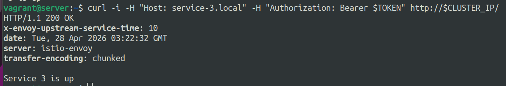

2. **Sem token (Esperado: 403 Forbidden):**
```bash
curl -i -H "Host: service-3.local" http://$CLUSTER_IP/
```
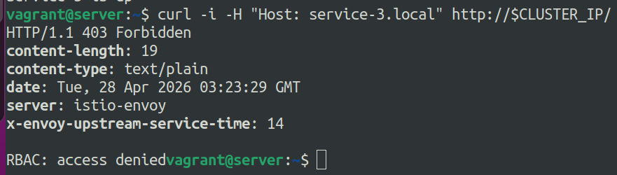

3. **Com token inválido (Esperado: 401 Unauthorized):**
```bash
curl -i -H "Host: service-3.local" -H "Authorization: Bearer token-adulterado" http://$CLUSTER_IP/
```
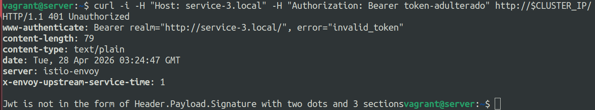


### 5.2. Bloqueio de acesso direto ao `service-2`

A `AuthorizationPolicy` do `service-2` só permite requisições originadas pela Service Account do `service-1`.

1. **Acesso bloqueado por fora do Ingress:** (O serviço sequer é exposto via VirtualService para a rua).
```bash
curl -i -H "Host: service-2.local" http://$CLUSTER_IP/ 
# Esperado: 404 Not Found (O Ingress não conhece essa rota externa)
```
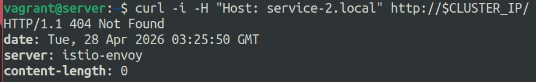

2. **Falha ao tentar acessar o `service-2` a partir do `service-3`:**
```bash
kubectl exec -it deploy/service-3 -n service-3 -- curl -i http://service-2.service-2.svc.cluster.local
# Esperado: 403 Forbidden (RBAC: access denied - O service-2 só aceita do service-1)
```
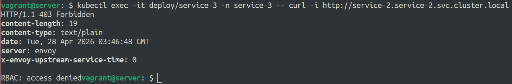
3. **Acesso autorizado via `service-1`:**
```bash
kubectl exec -it deploy/service-1 -n service-1 -- curl -i http://service-2.service-2.svc.cluster.local
# Esperado: 200 OK
```
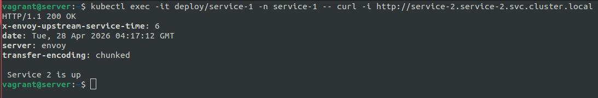

### 5.3. Isolamento lateral do `service-3`

O `service-3` possui uma política de `DENY` para tráfego interno originado dos serviços 1 e 2. 

1. **Falha ao tentar acessar o `service-3` a partir do `service-1`:**
```bash
kubectl exec -it deploy/service-1 -n service-1 -- curl -i http://service-3.service-3.svc.cluster.local
# Esperado: 403 Forbidden (RBAC: access denied)
```


2. **Falha ao tentar acessar o `service-3` a partir do `service-2`:**
```bash
kubectl exec -it deploy/service-2 -n service-2 -- curl -i http://service-3.service-3.svc.cluster.local
# Esperado: 403 Forbidden (RBAC: access denied)
```
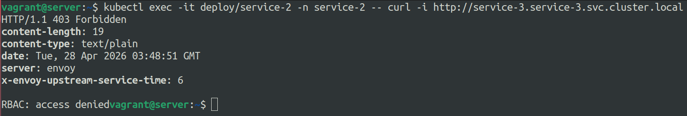


## 6. Justificativa de decisões não triviais

Durante o desenvolvimento da infraestrutura, algumas decisões arquiteturais foram tomadas para balancear segurança, performance e viabilidade do ambiente local:

* **K3s sem Traefik:** O K3s foi inicializado com a flag `--disable traefik`. Isso foi crucial para evitar conflitos de *bind* nas portas 80 e 443 do host, permitindo que o `istio-ingressgateway` assumisse o controle total do tráfego de borda. 

* **Escopo global do PeerAuthentication:** Em vez de aplicar o mTLS por namespace, optou-se por uma política `STRICT` alocada no namespace `istio-system` (comportamento global). Essa decisão garante que qualquer novo serviço adicionado futuramente ao cluster nasça protegido e com tráfego em texto plano bloqueado por padrão.

* **Algoritmo JWT e JWKS Remoto:** Utilizou-se o algoritmo **RS256** (padrão do *demo token* do Istio). Como o escopo do desafio é voltado para um ambiente de laboratório e dispensa explicitamente o uso de um Identity Provider (IdP), a escolha por um JWKS público hospedado no GitHub foi a decisão arquitetural mais enxuta.

* **Imagens Base (Containers):** Em vez de utilizar a imagem `httpbin` (como sugerido pra esse desafio), optou-se pela `curlimages/curl` operando em conjunto com utilitários simples (`nc` e `echo`). Essa decisão técnica foi tomada porque ter o `curl` embarcado nativamente no container facilita imensamente a validação das regras de comunicação leste-oeste: permite testar a conexão direta de um pod para outro (via `kubectl exec`) sem atritos.

* **Geração Dinâmica do Token do K3s:** Para evitar o hardcoding do token, o código Ruby no `Vagrantfile` gera o `K3S_TOKEN` via `SecureRandom` no primeiro boot e o oculta no arquivo `.k3s_token` (adicionado ao `.gitignore`).

---

## 7. (Bônus) Autoscaling orientado a eventos (KEDA + Prometheus)

### Métrica e Algoritmo Escolhidos
* **Métrica:** `istio_requests_total` (Extraída diretamente da telemetria do Envoy/Istio via Prometheus).

* **Query:** `sum(increase(istio_requests_total{destination_app="service-1", reporter="destination"}[2m]))`

* **Justificativa do Algoritmo e Métrica:** Foi utilizada a função `increase` em uma janela móvel de `[2m]` em vez da função `rate`. O `increase` trabalha com a volumetria absoluta e inteira de requisições na janela, facilitando o cálculo exato do *threshold* pelo HPA, que lida melhor com números inteiros do que com as frações por segundo geradas pelo `rate`. 
* A janela de 2 minutos atua suavizando anomalias (*spikes* de poucos segundos), impedindo um *scale-up* precipitado. Paralelamente, o controle de *flapping* (efeito "ioiô" de criação e destruição rápida) fica delegado ao `cooldownPeriod` nativo do KEDA, que garante um *scale-down* gracioso e atrasado caso o tráfego caia.

* **Threshold (Gatilho):** Definido no `ScaledObject` como `6000` requisições acumuladas. Na janela de 2 minutos, isso equivale a um limite de tolerância de aproximadamente **50 Requisições por Segundo (RPS)** por réplica antes que a latência comece a degradar e o KEDA decida escalar.

### Script k6 e Demonstração do Fluxo
Para validar a arquitetura, foi criado um script de teste de carga utilizando a ferramenta **k6** (`environment/kubernetes/scripts/load-test.js`). 

**Configuração do teste:**
* **Carga:** 10 Virtual Users (VUs) simultâneos rodando por 1 minuto.
* **Segurança:** O script injeta o token estático validado dinamicamente no header `Authorization: Bearer` para passar pela `AuthorizationPolicy` do Istio.

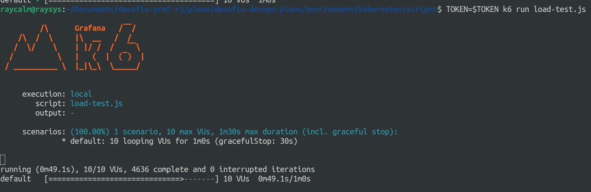 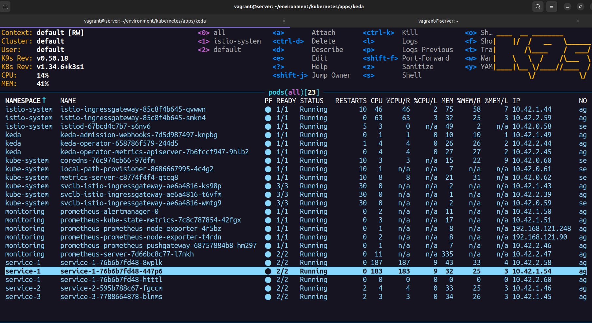 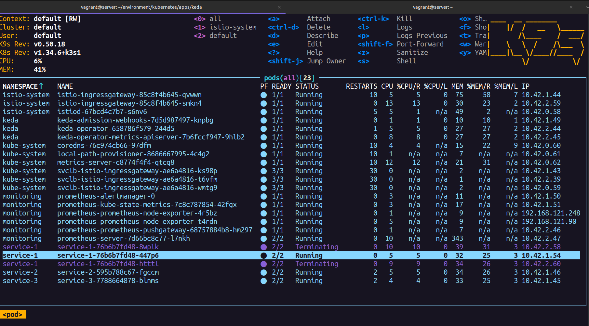
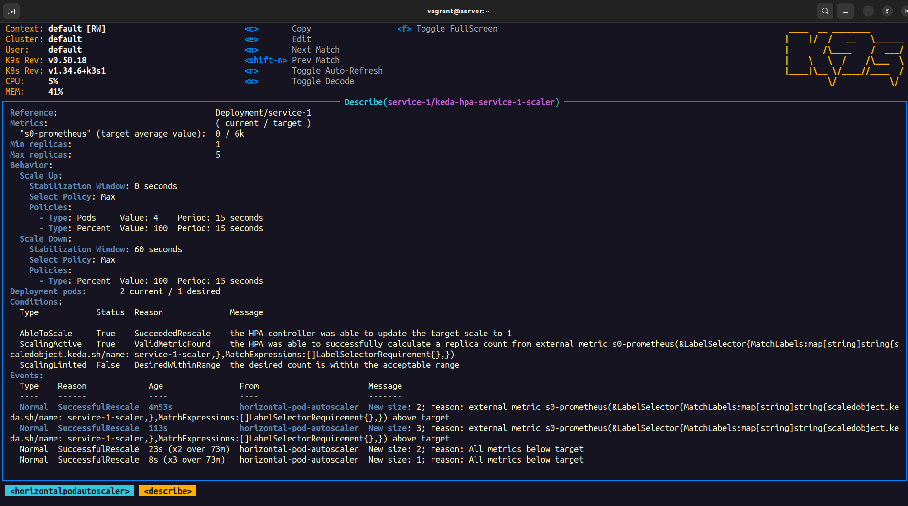